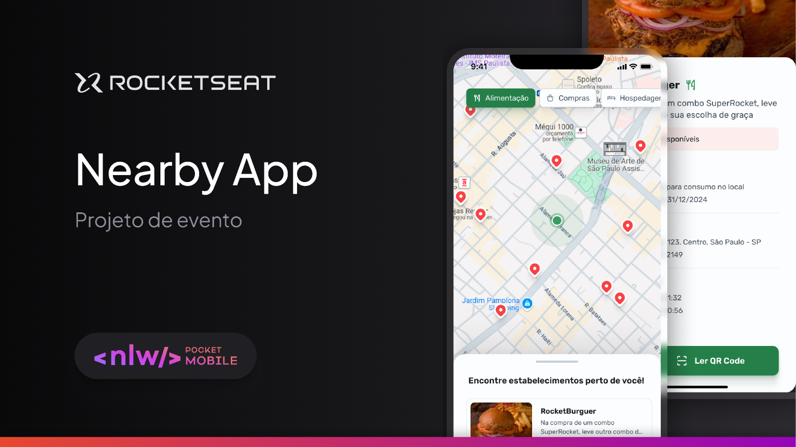
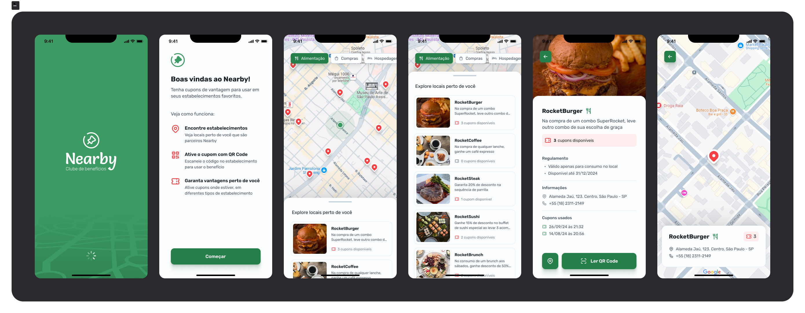

# Nearby App





O **Nearby App** é um aplicativo mobile de clube de benefícios, projetado para ajudar os usuários a encontrarem e utilizarem cupons exclusivos em estabelecimentos próximos à sua localização. Desenvolvido durante o evento **NLW Pocket Mobile** da **Rocketseat**, o aplicativo combina simplicidade e funcionalidade, conectando pessoas a negócios locais e promovendo o consumo na região.

## Funcionalidades

- Exibição de cupons exclusivos para estabelecimentos locais.
- Geolocalização para sugerir benefícios próximos ao usuário.
- Interface intuitiva e responsiva, projetada com **React Native** e estilizada com **Styled Components**.
- Exploração de negócios locais e incentivos ao consumo na comunidade.

## Tecnologias Utilizadas

- **React Native**: Framework para o desenvolvimento de aplicativos móveis multiplataforma.
- **Styled Components**: Biblioteca para estilização dinâmica e modular de componentes React.
- **Expo**: Ferramenta para facilitação no desenvolvimento e testes do aplicativo.
- **TypeScript**: Superset do JavaScript que adiciona tipagem estática ao projeto.

## Requisitos para Execução

Antes de iniciar, certifique-se de ter instalado em sua máquina:

- Node.js
- Yarn ou npm
- Expo CLI

## Como Rodar o Projeto

1. Clone o repositório:
   ```bash
   git clone https://github.com/seuusuario/nearby-app.git
   cd nearby-app
   ```

2. Instale as dependências:
   ```bash
   npm install
   # ou
   yarn install
   ```

3. Inicie o servidor de desenvolvimento:
   ```bash
   expo start
   ```

4. Abra o aplicativo no seu dispositivo móvel:
   - Use o aplicativo Expo Go (disponível na App Store ou Google Play) para escanear o QR code gerado pelo servidor de desenvolvimento.

Feito com 💜 durante o evento **NLW Pocket Mobile** da **Rocketseat**.

